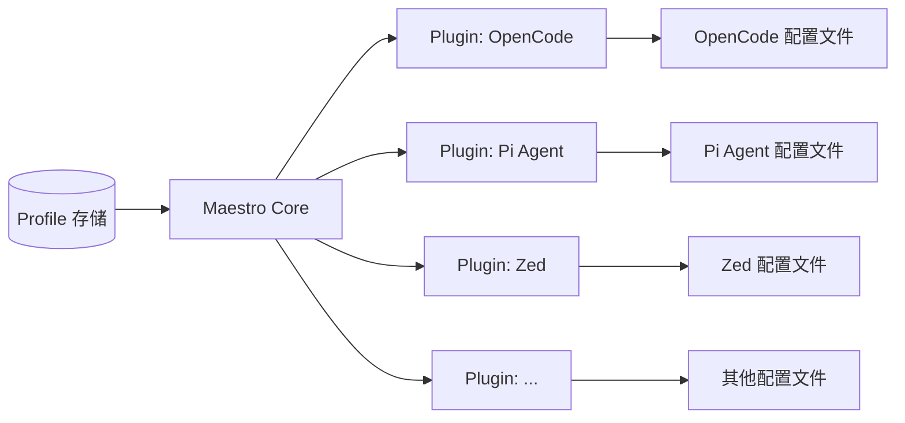

# Agent Maestro

统一管理多种 Agent 工具的 Profile（provider、model、mcp、skill）。Maestro 自身是 Profile 的唯一事实来源，通过插件把 Profile 投影到各 Agent 工具。

## 特性

- **Profile 中心化管理**：在一处维护 provider、model、mcp、skill 四类配置，命名并复用，不绑定任何具体 Agent 工具。
- **插件化适配**：每一种 Agent 工具由对应的 Plugin 负责把 Profile 渲染成该工具的配置格式并写入其配置文件，单向投影、不反向读取。
- **可扩展的插件生态**：基于公开的 Plugin SDK，用户可自行实现插件；插件以进程内动态加载的方式运行，并支持从远程（GitHub、npm）安装与更新。

## 支持的 Agent 工具

- [ ] [OpenCode](https://opencode.ai/)
- [ ] [Pi Agent](https://pi.dev)
- [ ] [Zed](https://zed.dev)
- [ ] ...

## 支持的平台

基于 Tauri v2，Maestro 提供桌面端应用，支持以下平台：

- **Windows**：Windows 10 及以上（x86_64、aarch64）
- **macOS**：Intel 与 Apple Silicon（aarch64）
- **Linux**：主流发行版（x86_64），各发行版所需系统依赖详见 [Tauri 前置条件](https://tauri.app/start/prerequisites/)

## 架构概览



Maestro Core 负责 Profile 的存储、编辑与投影调度；Plugin 运行在与主应用相同的进程内，通过 SDK 暴露的接口注册自身能力，并按目标工具的配置格式完成渲染与写入。

## 插件

插件是 Maestro 与具体 Agent 工具之间的桥梁，遵循以下原则：

1. **进程内动态加载**：插件在运行时被加载到 Maestro 进程中，无需独立运行时。
2. **基于 SDK 开发**：使用官方发布的 Plugin SDK 即可实现新的 Agent Tool 支持。
3. **远程分发与安装**：支持从 GitHub 仓库或 npm 包安装、升级插件。
4. **单向投影**：插件只负责把 Profile 写入目标工具，不反向解析或同步工具侧的改动。

> 插件 SDK 的具体接口与开发指南将在后续版本提供。

## 技术栈

- 桌面壳：[Tauri](https://tauri.app) v2
- 前端：[React](https://react.dev) + [Vite](https://vitejs.dev)
- 其他依赖与选型见 [`package.json`](./package.json) 与 `src-tauri/Cargo.toml`。

## 开发

### 环境要求

- [Node.js](https://nodejs.org)（推荐 LTS 版本）
- [pnpm](https://pnpm.io)
- [Rust](https://www.rust-lang.org/tools/install)（stable）
- 各平台 Tauri 所需的系统依赖，详见 [Tauri 前置条件](https://tauri.app/start/prerequisites/)。

### 常用命令

```bash
# 安装依赖
pnpm install

# 启动开发模式（同时启动 Vite 与 Tauri）
pnpm tauri dev

# 构建生产版本
pnpm tauri build
```

## 文档

- [CONTEXT.md](./CONTEXT.md)：领域语言与核心概念。
- [`docs/agents/`](./docs/agents)：面向 Agent 的协作指南。
